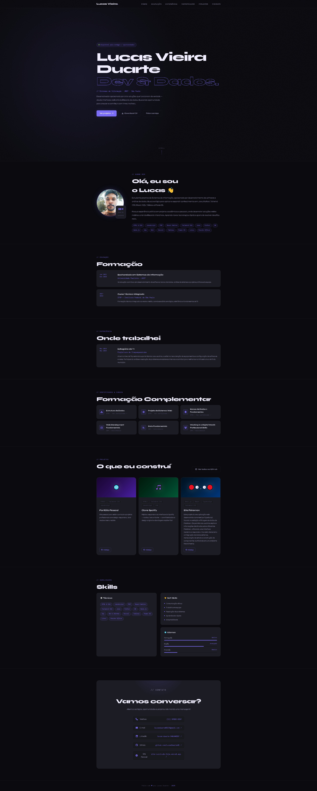

# Site-Curriculo


## 📝 Descrição

Este repositório contém o código-fonte de um site de currículo pessoal, desenvolvido para apresentar minhas habilidades, experiência profissional, formação acadêmica e projetos. O objetivo é fornecer uma plataforma online acessível e visualmente atraente para recrutadores e colaboradores em potencial, destacando minhas qualificações de forma clara e organizada.

## ✨ Funcionalidades

*   **Informações Pessoais:** Exibição de dados de contato e um breve resumo sobre mim.
*   **Experiência Profissional:** Detalhes sobre cargos anteriores, responsabilidades e conquistas.
*   **Formação Acadêmica:** Informações sobre cursos, graduações e certificações.
*   **Habilidades:** Listagem de competências técnicas e interpessoais.
*   **Projetos:** Seção dedicada a apresentar outros projetos desenvolvidos, com links e descrições.
*   **Download de Currículo:** Opção para baixar o currículo em formato PDF.
*   **Design Responsivo:** Layout adaptável para visualização em diferentes dispositivos (desktops, tablets e smartphones).

## 🚀 Tecnologias Utilizadas

*   **Frontend:**
    *   
    *   
    *    (Se aplicável para interatividade)

## ⚙️ Instalação e Configuração

Para visualizar este site de currículo localmente, siga os passos abaixo:

```bash
# Clone o repositório
git clone https://github.com/LucasDuarte42/Site-Curriculo.git

# Navegue até o diretório do projeto
cd Site-Curriculo

# Abra o arquivo index.html no seu navegador preferido
# Exemplo (no Linux/macOS):
open src/index.html
# Exemplo (no Windows):
start src/index.html
```

## 💡 Como Visualizar

Após abrir o arquivo `index.html` no navegador, você poderá navegar pelas diferentes seções do currículo. O site foi projetado para ser intuitivo e fácil de usar. Você também pode acessar a versão online do site através do link de deploy (se houver).



## 📂 Estrutura de Diretórios

O projeto possui a seguinte estrutura de diretórios:

```
Site-Curriculo/
├── src/                  # Código fonte principal (HTML, CSS, JS)
│   ├── certificados/     # Pasta para certificados e diplomas
│   ├── curriculo/         # Pasta para o arquivo PDF do currículo
│   ├── img/              # Imagens utilizadas no site
│   ├── index.html        # Página principal do currículo
│   ├── input.css         # Arquivo CSS de entrada (se usar pré-processador)
│   └── output.css        # Arquivo CSS compilado/final
├── .gitattributes        # Configurações do Git
├── README.md             # Este arquivo
├── package.json          # Metadados do projeto e dependências
├── package-lock.json     # Bloqueio de dependências
└── ...                   # Outros arquivos de configuração
```

## 📄 Licença

Este projeto está licenciado sob a Licença MIT. Veja o arquivo [LICENSE](LICENSE) para mais detalhes.

## 📞 Contato

*   **Lucas Duarte** - [LinkedIn](https://www.linkedin.com/in/lucas-duarte-54b644297)
*   **GitHub:** [LucasDuarte42](https://github.com/LucasDuarte42)

---

